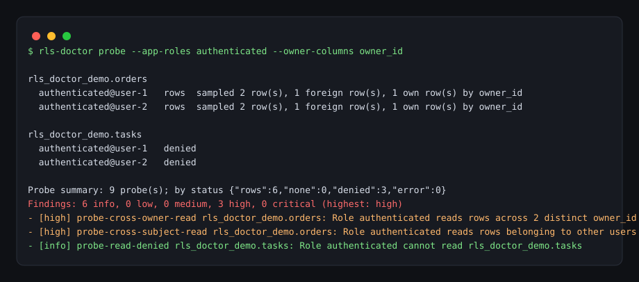
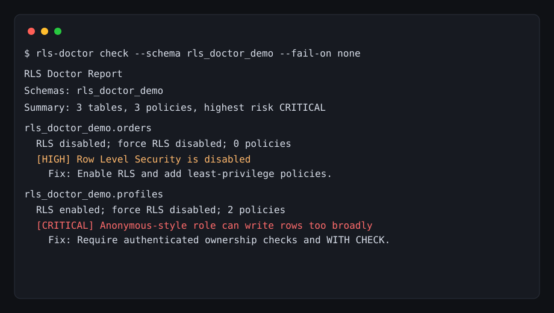

# RLS Doctor

[](https://github.com/subhajitlucky/rls-doctor/actions/workflows/ci.yml)
[](https://www.npmjs.com/package/rls-doctor)
[](https://www.npmjs.com/package/rls-doctor)

**Don't trust your RLS. Prove it.**



Can user A read user B's rows? Row Level Security is one of Postgres's strongest isolation tools, and one of the easiest to leave half-configured. You enable RLS, add a policy, and move on — but policies OR-combine, `WITH CHECK` silently falls back to `USING`, table owners bypass RLS entirely, and `TRUNCATE` is never protected at all.

`rls-doctor` reads your catalog and tells you what's actually reachable. And with `probe`, it stops analyzing and just *shows you*, impersonating your app roles in a transaction it always rolls back.

```bash
npx rls-doctor check    # reads DATABASE_URL or SUPABASE_DB_URL
```

```txt
RLS Doctor Report
Generated: 2026-07-12T00:00:00.000Z
Schemas: public

Summary: 1 tables, 0 policies, highest risk HIGH
Findings: critical 0, high 1, medium 0, low 0, info 0

public.orders
  RLS disabled; force RLS disabled; 0 policies
  [HIGH] RLS-disabled table is reachable by an application role
    public.orders has no row-level checks; Application role authenticated and
    can exercise SELECT granted to authenticated.
    Fix: Enable RLS and add least-privilege policies for each application role.
    Suggested SQL:
      alter table "public"."orders" enable row level security;
```



---

## Prove a cross-tenant leak instead of guessing

Most RLS review is reading policies and hoping. `probe` is behavioral:

```bash
rls-doctor probe --connection "$DATABASE_URL" --schema public \
  --app-roles authenticated --subjects \
  00000000-0000-0000-0000-000000000001 \
  00000000-0000-0000-0000-000000000002
```

It sets `request.jwt.claims` inside the transaction, so `auth.uid()` resolves to each real Supabase user, then counts whose rows that identity can read.

```txt
- [high] probe-cross-owner-read rls_doctor_demo.orders:
  Role authenticated reads rows across 2 distinct owner_id values
- [high] probe-cross-subject-read rls_doctor_demo.orders:
  Role authenticated reads rows belonging to other users
```

**It never mutates anything.** `probe` opens `begin ... read only` and always rolls back — safe against a production read replica.

## Install

```bash
npx rls-doctor check              # no install
npm install -g rls-doctor         # global
```

Requires Node.js 20 or later. Prefer `DATABASE_URL` or `SUPABASE_DB_URL` with read-only audit credentials — passing a secret via `--connection` exposes it in shell history and process listings.

## Commands

| Command | What it does |
| --- | --- |
| `check` | Audit one or more schemas |
| `explain <table>` | Full detail on a single table |
| `probe` | Impersonate app roles and prove actual row access |
| `mcp` | Serve read-only MCP tools over stdio |

```bash
rls-doctor check --schema public --fail-on high
rls-doctor explain public.profiles
rls-doctor probe --app-roles authenticated --owner-columns tenant_id
```

### `check` options

```txt
-c, --connection <url>       Postgres connection string
-s, --schema <schema...>     Schemas to audit. Default: public
--json                       Machine-readable JSON
--format <format>            text, json, or sarif. Default: text
--fail-on <severity>         info, low, medium, high, critical, none. Default: high
--baseline <path>            Compare with a prior JSON report; only new findings fail
--update-baseline            Write the current report to --baseline and exit 0
--statement-timeout <ms>     Catalog query timeout. Default: 10000
--app-roles <role...>        Extra roles to treat as reachable application identities
```

On generic Postgres (not Supabase), pass your real roles so grants and memberships through them are analyzed at the same severity as `authenticated`:

```bash
rls-doctor check --connection "$DATABASE_URL" --app-roles app_user web_user --fail-on high
```

### `probe` options

```txt
--app-roles <role...>        Roles to impersonate (required)
--subjects <uuid...>         Supabase user ids to simulate via request.jwt.claims
--owner-columns <col...>     Owner/tenant columns to compare
                             (default: owner_id user_id tenant_id account_id)
--sample-limit <n>           Rows sampled per table (default: 1000)
```

Probe findings: `probe-cross-owner-read` and `probe-cross-subject-read` (High), `probe-role-unavailable` (Medium), `probe-error` (Low), plus informational `probe-reads-rows`, `probe-subject-reads-own-rows`, `probe-reads-no-rows`, and `probe-read-denied`.

## What it catches

| Check | Severity | Why it matters |
| --- | --- | --- |
| Public-like unconditional write | Critical | A `public`/`anon` policy with an unconditional predicate for `INSERT`, `UPDATE`, `DELETE`, or `ALL` |
| Reachable `TRUNCATE` | High | RLS never protects `TRUNCATE` |
| RLS disabled and reachable | High | An app-facing role has row access plus schema `USAGE`, or can `SET ROLE` to a superuser, with no row checks |
| Public-like unconditional read | High | `public`/`anon` policy with unconditional `USING` for `SELECT`/`ALL` |
| Application path to `SUPERUSER`/`BYPASSRLS` | High | These attributes bypass RLS even with `FORCE` enabled |
| Broad default table privilege | High writes / Medium reads | Future tables created by that owner inherit the privilege |
| Omitted `WITH CHECK` | Medium | The write constraint silently falls back to `USING` |
| RLS enabled with no policies | Medium | Non-owner roles are default-denied; app access breaks |
| Multiple permissive policies | Medium | Policies for the same role/command are OR-combined |
| RLS disabled, not currently reachable | Medium | A later grant can expose the table |
| `FORCE RLS` disabled | Info | The table owner bypasses RLS |

Checks follow PostgreSQL command semantics: `SELECT` evaluates `USING`; `INSERT` evaluates `WITH CHECK`; `DELETE` evaluates `USING`; `UPDATE` evaluates both. When an `UPDATE` or `ALL` policy omits `WITH CHECK`, Postgres falls back to its `USING` expression — and `rls-doctor` analyzes that *effective* check. `ALL` is evaluated as each applicable command.

It follows direct, inherited, and `SET ROLE` membership paths (including PostgreSQL 16 per-membership options; 15 is normalized), and reports current access separately from default privileges affecting future tables.

## GitHub Action

Findings land in the Security tab.

```yaml
permissions:
  contents: read
  security-events: write

steps:
  - uses: actions/checkout@v5
  - uses: subhajitlucky/rls-doctor@v0.3.1
    with:
      connection: ${{ secrets.READONLY_DATABASE_URL }}
      schema: public
      format: sarif
      upload: "true"
      fail-on: high
      app-roles: authenticated app_user
```

SARIF results carry `logicalLocations` (`schema.table`) and stable `partialFingerprints`, so code scanning tracks findings across runs even though tables aren't files.

## Or run it in CI without the Action

```yaml
name: RLS Audit
on:
  pull_request:
    branches: [main]

jobs:
  rls-audit:
    runs-on: ubuntu-latest
    steps:
      - uses: actions/checkout@v5
      - uses: actions/setup-node@v5
        with:
          node-version: 22.x
      - run: npx rls-doctor check --schema public --json --fail-on high
        env:
          DATABASE_URL: ${{ secrets.READONLY_DATABASE_URL }}
```

Full guide: [`docs/guides/github-actions.md`](docs/guides/github-actions.md)

## Baselines

Adopt on an existing database without failing on day one:

```bash
rls-doctor check --schema public --baseline rls-baseline.json --update-baseline
rls-doctor check --schema public --baseline rls-baseline.json --fail-on high
```

Fingerprints derive from finding id, schema, table, and detail — so a changed predicate or privilege correctly re-reports as new. JSON reports include `baseline: { new, unchanged, resolved }`.

### Exit behavior

- `0` — no finding meets the configured threshold
- `1` — a finding meets or exceeds `--fail-on`, **or** Commander usage/option-parsing error
- `2` — caught runtime failure: missing credentials, connection/catalog error, invalid action value, requested table not found

`--fail-on none` always disables finding-based failure. A clean report uses `highestSeverity: "none"`, so `--fail-on info` still exits `0` when there are no findings.

## MCP server

```bash
claude mcp add rls-doctor -- npx -y rls-doctor mcp
```

Read-only tools: `check_rls`, `probe_access`, `explain_table`.

## Agent skill

```bash
npx skills add subhajitlucky/rls-doctor
```

Teaches compatible coding agents when to run the audit, how to use read-only database credentials, and how to avoid leaking connection strings.

## Supabase

`rls-doctor` audits catalog-visible PostgreSQL RLS, grants, and role paths. It does not audit hosted Supabase management settings, views, or functions — review Data API configuration separately. See [`docs/guides/supabase-rls-patterns.md`](docs/guides/supabase-rls-patterns.md) for unsafe vs. safer policy examples.

## Try it without a database

`demo/` holds disposable fixtures — `unsafe-schema.sql` (intentionally risky policies) and `safe-schema.sql` (a safer reference shape).

```bash
npm run demo   # prints local demo steps
```

Never run demo fixtures against production.

## Architecture

```txt
CLI command
  -> catalog loader
  -> audit analyzer
  -> text / JSON reporters
  -> shell exit code
```

Deeper notes: [`docs/architecture.md`](docs/architecture.md)

## Safety and scope

`rls-doctor` only queries Postgres catalogs. It sanitizes connection credentials from its own errors. Probe transactions are read-only and always rolled back.

It's a focused catalog audit, **not** a proof or compliance product. It does not:

- prove arbitrary SQL predicate correctness or simulate `can`-style checks
- audit views, functions, or hosted Supabase management configuration
- automatically execute suggested SQL — suggestions are review templates
- make a compliance claim

It's a security review aid, not a replacement for application-level authorization tests, grant reviews, or a full production security audit.

## Development

```bash
npm ci && npm run ci
```

`npm run test:integration` starts its own disposable Postgres container, opts into destructive fixtures, runs `check`/`explain`, and removes the container. Invoking `scripts/run-integration.js` directly refuses to run unless `RLS_DOCTOR_ALLOW_DESTRUCTIVE_TESTS=1` is set — use that guard only with a disposable database.

## Roadmap

- Markdown report output
- Policy diffing between branches
- Optional SQL migration suggestions

## License

MIT
